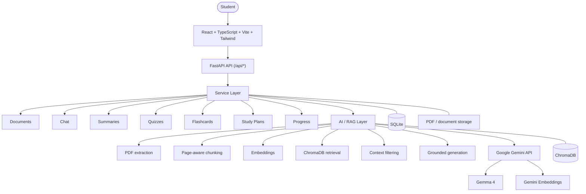
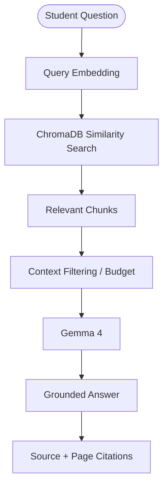

# StudyMate — Your notes. Your AI. Your study space.

[](LICENSE)

StudyMate turns a student's PDFs and notes into a grounded AI study workspace for asking questions, summaries, quizzes, flashcards, study plans, and progress tracking.

**[Live Demo](https://studymate-frontend-hbi2.onrender.com/) · [GitHub Repository](https://github.com/codewithvishuuu/studymate)**

Built for the DEV.to Hacktoberfest Weekend 2026 **Build for a Friend** challenge — a grounded AI study companion built for a friend, powered by Gemma and RAG.

## Live Demo

Try StudyMate directly in your browser: **https://studymate-frontend-hbi2.onrender.com/**

Upload study material, ask grounded questions, generate summaries and quizzes, practice flashcards, and build a study plan.

> Ephemeral storage: the current Render free deployment uses ephemeral storage. Uploaded documents and history live under `backend/data/` (uploads, SQLite, ChromaDB) and should not be considered permanent — redeploys and restarts can wipe them unless a persistent disk is attached.

## What it is

StudyMate uses a local-first data architecture for documents, metadata, SQLite state, and ChromaDB vectors, while AI inference and cloud embeddings are handled through the Google Gemini API from the backend.

It is not fully offline AI, not offline Gemma inference, and not permanent cloud storage. The frontend never calls Google directly — the backend owns all AI orchestration with a backend-held key.

## Architecture



- Frontend never calls Google. Backend owns AI orchestration.
- Model names are env-configured (`GEMMA_MODEL`, `EMBEDDING_MODEL`); the key is backend-only (`GOOGLE_API_KEY`); the single Google caller is `backend/app/services/ai_provider.py` behind the `ai.py` facade.
- Metadata store: SQLite via stdlib (`studymate.db`). Vectors: local ChromaDB collection `studymate_chunks`. Documents: `backend/data/uploads/`. Only inference and embeddings are cloud.

## RAG Pipeline

PDF → text extraction (`pypdf`) → cleaning → page-aware chunking → cloud embeddings → ChromaDB → semantic retrieval → threshold and context budget → Gemma generation → grounded answer → source and page citations.

- Extraction is per page, so every chunk keeps `document_id`, `filename`, `page_number`, and `chunk_id`. Citations point back to the source document and page.
- Retrieval uses top-k (`rag_top_k`, default 5) with a relevance floor (`rag_min_score`, default 0.10) and a context budget (`rag_max_context_chars`, default 12000).
- Not-found behavior is explicit. When nothing relevant is retrieved, or when the model refuses on the retrieved context, the answer is exactly:

  `I couldn't find this information in your uploaded study material.`

  The system does not fabricate citations — unused neighbors are never presented as sources.

## Query flow



Terminology matches the code: `ai.embed` → `vector.query` → score threshold + char budget → `ai.generate` → `sources` with `document_id`, `filename`, `page`, `excerpt`, and `chunk_id`.

## Features

### Notes & Materials

Upload and manage study PDFs with processing status and document metadata.

### Ask

Ask questions grounded in selected study material with source/page citations.

### Summaries

Generate revision-ready summaries from selected documents (`short` and `key-points` modes).

### Quiz

Generate quizzes with configurable count (1–20) and difficulty (`easy`, `medium`, `hard`) and track results and weak topics.

### Flashcards

Practice active recall using generated flashcards.

### Study Plan

Create a revision roadmap based on subject, exam date, and available study time (10–480 minutes per day, 60-day horizon cap).

### Progress

Track study activity and progress — documents, quizzes taken, questions asked, average score, weak topics, and completed sessions.

### Settings

Manage profile and study preferences and inspect AI configuration exposed by the backend.

## Why Gemma?

Gemma is part of the core generation pipeline, not a decorative feature:

Student question → retrieval from their material → relevant context → Gemma 4 → grounded response.

- Generation model: `gemma-4-26b-a4b-it` (open-weight Gemma family, env-configured via `GEMMA_MODEL`).
- Embeddings: `gemini-embedding-001` (Google-hosted, env-configured via `EMBEDDING_MODEL`).
- The deployed version serves Gemma through the Google Gemini API. There is no local inference — no Ollama, no GPU needed.

## Deployment

- Frontend: Render Static Site
- Backend: Render Web Service

```text
Frontend (VITE_BACKEND_URL)
  ↓
Backend (FastAPI)
  ↓
Google Gemini API
```

- Frontend: https://studymate-frontend-hbi2.onrender.com/
- Backend: https://studymate-backend-zujy.onrender.com/
- Health check: `GET /api/health`
- The frontend uses a Render SPA rewrite (`/*` → `/index.html`) so client-side routes can be refreshed directly.
- `VITE_BACKEND_URL` is baked in at frontend build time; `FRONTEND_URL` must allowlist the frontend origin for CORS; `GOOGLE_API_KEY` stays a backend secret and is never committed.
- Note: `render.yaml` in the repo is a blueprint with placeholder URLs. The live deployment uses the `hbi2` frontend and `zujy` backend URLs above.

## Project structure

```text
frontend/
  src/
    pages/
    components/
    lib/

backend/
  app/
    api/
    core/
    services/
    schemas/
  tests/
```

Only directories shown — every path above exists. Key routes: `GET /api/health`, `POST /api/documents/upload`, `GET /api/documents`, `GET /api/documents/{doc_id}`, `DELETE /api/documents/{doc_id}`, `POST /api/chat`, `DELETE /api/chat/{session_id}`, `POST /api/summaries/generate`, `POST /api/quiz/generate`, `POST /api/quiz/submit`, `POST /api/flashcards/generate`, `POST /api/study-plan/generate`, `GET /api/progress`, `GET /api/settings`, `PUT /api/settings`.

## Data & privacy model

- Documents are processed by the backend (`pypdf` extraction, validation, 50 MB limit).
- SQLite stores application metadata and state.
- ChromaDB stores vector embeddings and retrieval data.
- AI inference uses the Google Gemini API.
- API credentials remain backend-side.
- The frontend does not directly call Google AI services.

No additional privacy guarantees are claimed beyond what the code shows.

## Setup

Prerequisites: Node.js 24+, Python 3.11+, a Google Gemini API key (Google AI Studio). No Ollama, no GPU needed.

Backend (from `backend/`; set `GOOGLE_API_KEY` in `.env` first — see `.env.example`):

```sh
cd backend
pip install -r requirements.txt
python -m uvicorn app.main:app --port 8000
```

Frontend:

```sh
cd frontend
npm install
npm run dev
```

Open http://localhost:5173. Never commit `.env` (see `.env.example`).

## Testing

46 backend tests, all mocked — no key needed. Run from `backend/`: `python -m pytest tests -q`.

Covers: health, page-aware chunking (overlap, metadata), documents (valid, invalid, empty, corrupt, oversize, traversal, delete with vector cleanup), chat (not-found, 404 scope, 422 validation, threshold filtering, real citations, idempotent clear), provider (missing key, invalid key, quota, timeout, model errors, empty output, health states, malformed-JSON retry, end-to-end RAG, summary, quiz, and flashcards through the provider facade), quiz scoring and weak topics, summaries, flashcards, study-plan validation, progress aggregation, and settings.

Real provider smoke test (needs your key): `python scripts/gemini_smoke.py` from `backend/`. Frontend build: `npm run build`.

## Limitations

- A `GOOGLE_API_KEY` is required for AI answers, summaries, quiz and flashcard generation, and cloud embeddings. Without it those paths return honest 503s, while upload validation, quiz scoring, plans, progress, and settings keep working.
- Text-extractable PDFs only — scanned images need OCR (future work). Password-protected and corrupt PDFs are rejected with explicit errors.
- Current deployment uses ephemeral Render storage — uploads, SQLite, and ChromaDB can be wiped on redeploy or restart.
- Single user, no authentication.
- Synchronous generation — no background job queue; long generations block the request.
- Provider configuration: `gemma-4-26b-a4b-it` for generation and `gemini-embedding-001` for embeddings via the Google Gemini API.

## Future improvements

- OCR for scanned PDFs
- Better retrieval and reranking
- Hybrid search
- Spaced repetition
- Persistent production database and storage
- Authentication and multi-user support
- Background job queue
- Better study analytics
- More local inference options

Future features are not implemented yet.

## Friend handoff

Built for the DEV.to Hacktoberfest Weekend 2026 **Build for a Friend** challenge.

- Friend: [FRIEND_NAME] · Subject: [FRIEND_SUBJECT] · Problem: [FRIEND_STUDY_PROBLEM]
- Handoff date: [TBD] · Feedback: [FRIEND_FEEDBACK] (never fabricated — filled in after real use)

## Contribution

Issues and PRs welcome. Never commit `.env`, never fabricate citations or feedback.

## License

MIT — see [LICENSE](LICENSE).
